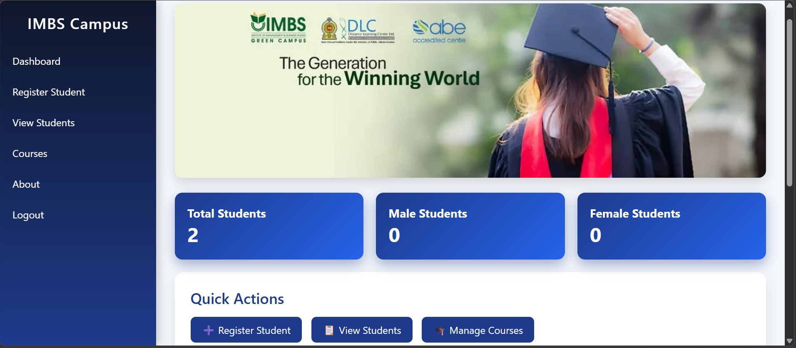
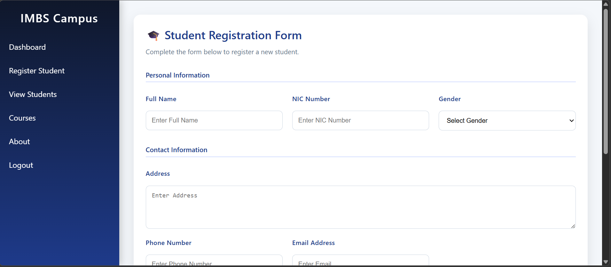
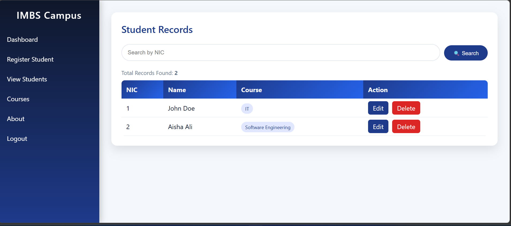
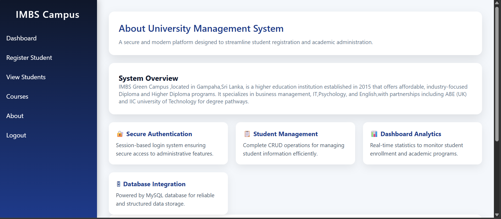

# 🎓 University Management System

A web-based University Management System developed using PHP, MySQL, HTML, CSS, and JavaScript. This system allows administrators to manage students, courses, and basic academic operations efficiently.

## 🚀 Features

* 🔐 Admin Login System
* 👨‍🎓 Student Registration
* 📋 View Students
* ✏️ Edit & Delete Student Records
* 📚 Course Management
* 🎨 Responsive UI Design

## 🛠️ Technologies Used

* Frontend: HTML, CSS, JavaScript
* Backend: PHP
* Database: MySQL
* Server: WAMP

## 📸 Screenshots
🔐 Admin Login

---
📊 Dashboard

---
👨‍🎓 Student Registration

---
📋 View Students

---
📚 Courses

---
✏️ About

## ⚙️ Installation Guide

1. Clone the repository:
git clone https://github.com/kishanisaubhagya897-lang/University-Registration-System.git

2. Move project to:
C:\wamp64\www\

3. ## 🗄️ Database Setup

To set up the database:

* Open phpMyAdmin
* Create a new database:
   university_db
* Import the SQL file:
   * Click **Import**
   * Choose file: `university_db.sql`
   * Click **Go**

📁 Database file included in this repository:
[Download Database](university_db.sql)

4. Run project:
http://localhost/university-system/

## 🔑 Default Login

* Username: admin
* Password: admin123

## 📌 Future Improvements

* Password hashing & security
* Role-based access control
* Student dashboard
* API integration

## 👨‍💻 Author

**Saubhagya**
Undergraduate IT Student | Full Stack Developer

## ⭐ Show Your Support

If you like this project, give it a ⭐ on GitHub!
